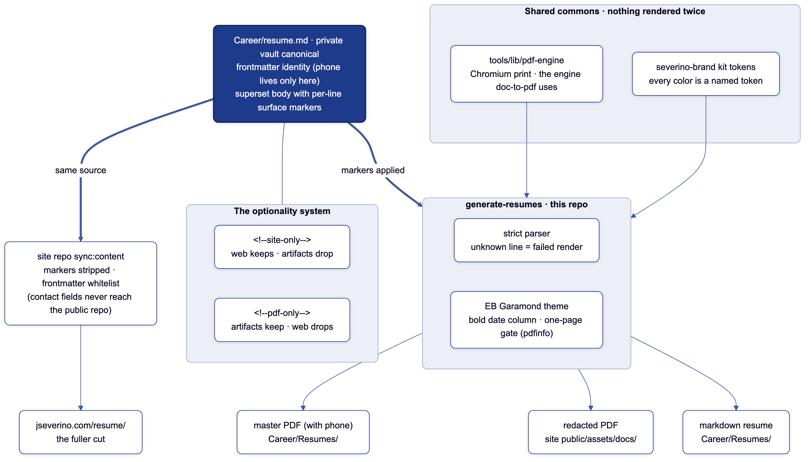

# resume-engine

One markdown file is the entire resume. This repo renders every surface
derived from it: a typeset one-page PDF, a redacted copy for the public site,
and a standalone markdown resume. It exists so the resume behind
[jseverino.com/resume/](https://jseverino.com/resume/) and the PDF served
there can never drift apart. Both are generated from the same canonical, one
command apart, and every artifact carries a footer colophon pointing back
here, the same way the site carries a View Source link.

## Architecture



The canonical resume lives in a private vault, outside this repo. Its
frontmatter carries the contact identity (the phone number exists nowhere
else), and its body is a superset of every surface. Two renderers consume it.

**generate-resumes** (this repo) parses the body with a strict grammar:
sections, organizations, roles, bullets, certification lines, project blocks.
An unrecognized line fails the render, so content drift is caught at generate
time, never on paper. The theme typesets vendored EB Garamond (OFL) on US
Letter with a bold date column, and a one-page gate (via `pdfinfo`) fails the
build rather than let the resume quietly grow a second page.

**The site sync** (in the
[jseverino.com](https://github.com/joeseverino/jseverino.com) repo) renders
the same file to the web page, stripping markers and whitelisting frontmatter
so contact fields never enter the public repo.

Per-line surface markers decide what each surface shows. A line suffixed
`<!--site-only-->` stays on the web page and off the artifacts;
`<!--pdf-only-->` is the reverse. The web page is the fuller cut (more
certifications, coursework detail, early-role history); the PDF is the curated
one-pager. No marker survives into any rendered output.

Nothing renders twice. The HTML-to-PDF machinery is the
[tools](https://github.com/joeseverino/tools) repo's shared `lib/pdf-engine`,
the same engine `doc-to-pdf` prints with, and every color is a named token
from the [severino-brand](https://github.com/joeseverino/severino-brand) kit.
The architecture figure above is itself rendered by the same toolchain
(`diagram`, brand-themed Mermaid).

## Usage

```sh
bin/generate-resumes
```

One command, three artifacts:

| Artifact | Destination | Contact line |
|---|---|---|
| Master PDF | `~/Documents/Career/Resumes/joseph-severino-resume.pdf` | includes phone |
| Public PDF | `<site repo>/public/assets/docs/joseph-severino-resume.pdf` | redacted |
| Markdown resume | `~/Documents/Career/Resumes/joseph-severino-resume.md` | redacted |

Both dependency repos are public. Clone
[tools](https://github.com/joeseverino/tools) and
[severino-brand](https://github.com/joeseverino/severino-brand) alongside this
repo (or point `TOOLS_HOME` and `BRAND_HOME` at them) and it runs offline:
local Chromium is the print engine, fonts are vendored, nothing is fetched.

## Design decisions

- **Strict parser over flexible parser.** The canonical has a known shape;
  anything outside it is a mistake, and mistakes should fail the render, not
  ship on paper.
- **One page, enforced.** Page overflow is a curation problem, not a
  typography problem. The fix is a `<!--site-only-->` marker, never smaller
  type.
- **No brand monogram on the artifact.** A resume travels through other
  people's systems and should carry only facts. The brand appears as color
  tokens and the footer colophon, nothing louder.
- **Redaction by construction.** The phone number lives in one private file
  and is injected only into the master PDF at render time. No public surface
  can leak what it never receives.

## Environment

| Variable | Default | Meaning |
|---|---|---|
| `LIFE_HOME` | `~/Documents/Life` | Vault root holding the canonical |
| `CAREER_HOME` | `~/Documents/Career` | Resumes output folder |
| `CODE_HOME` | `~/Documents/Code` | Code root |
| `TOOLS_HOME` | `$CODE_HOME/Assets/tools` | Shared pdf-engine |
| `BRAND_HOME` | `$CODE_HOME/Assets/severino-brand` | Brand kit (tokens) |
| `SITE_HOME` | `$CODE_HOME/Projects/jseverino.com` | Public PDF destination |
| `RESUME_BRAND_KIT` | severino-brand kit | Token source override |
| `RESUME_KEEP_HTML` | unset | Keep the intermediate HTML for inspection |

## License

MIT. The EB Garamond fonts under `lib/fonts/` are licensed separately under
the SIL Open Font License; see `lib/fonts/OFL.txt`.
